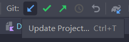
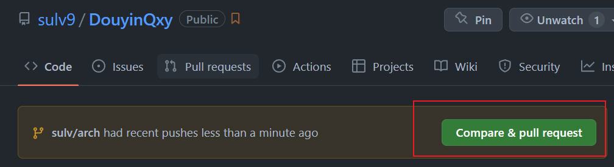
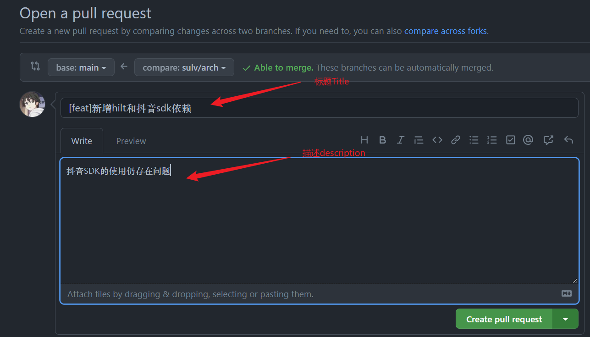
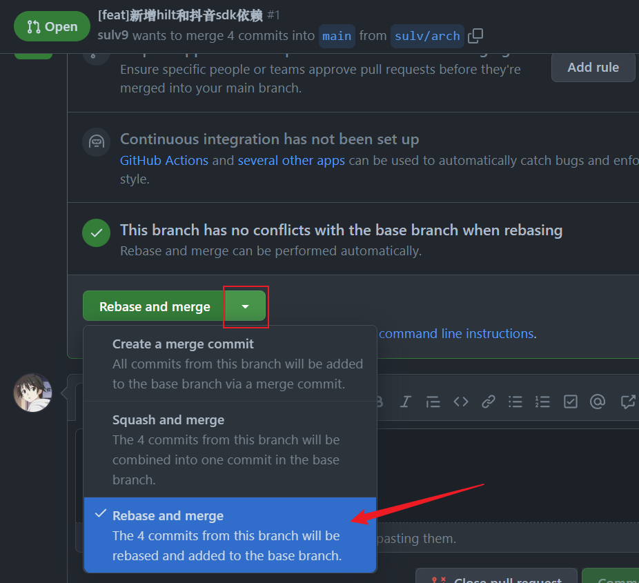
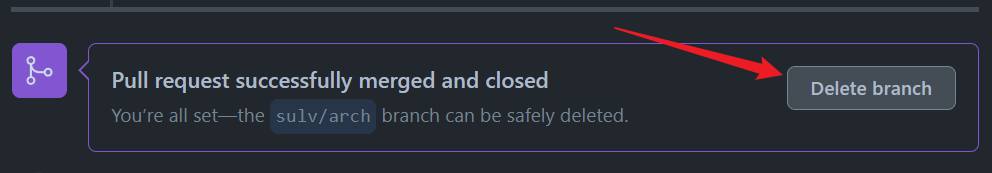

# git-workflow

1. 在首次被邀请进入本项目后，请先在Git Bash中使用`git clone https://github.com/sulv9/DouyinQxy.git`指令将远程仓库拉至本地（之后不需要再使用该指令）。

2. 接着使用Android Studio打开DouyinQxy项目，在群里下载`key-qxy.jks`和`secret.gradle`两个文件并将它们放到`DouyinQxy/build_logic/secret`目录下，等待项目加载完毕。

3. 打开Android Studio下方的`Terminal`控制台，在其中输入`git checkout -b [branchName]`来创建并切换到新的分支，注意这里的[branchName]是指你自己的分支名，分支名采用多层路径命名格式，按`[userName/taskName]`格式命名（不需要加[]），例如一个叫sulv的人打算开发个人中心模块，则分支名可以取`sulv/personal`，也即输入的指令为`git checkout -b sulv/personal`。

4. 切换完分支之后，继续输入`git pull origin main --rebase`指令从远端仓库拉去最新代码合并到本地仓库；或者您也可以使用AndroidStudio图形化界面拉去仓库，如下图所示蓝色的按钮所示，在AndroidStudi右上角的位置（点击后选择第二个包含Rebase的选项）：

   

5. 之后就可以开始编写你的代码了。在写完一部分代码后，请分别在`Terminal`中输入`git add .`和`git commit -m "[commitMessage]"`指令将修改的代码添加到git暂存区，其中[commitMessage]格式为`[Type] commit-message`，Type指此次提交类型，具体请见[Git Commit Type](#Git-Commit-Type)，commit-message即为此次代码修改的主要内容，最好在50字以内。例如这次我在个人模块新写了头像的UI，可以输入`git commit -m"[feat]个人中心模块新增头像功能"`。

6. 接着输入`git push --set-upstream origin [branchName]`提交本地代码至远程仓库，其中[branchName]和第三步中你填写的分支名一样哦，例如`git push --set-upstream origin sulv/personal`。

7. 打开`https://github.com/sulv9/DouyinQxy.git`网址，这是会出现如下图所示的按钮`Compare & pull request`，点击它：

   

8. 点击后会进入下图界面创建一个PR，title必填，就填你上面commit的信息即可，下方的描述可选填，然后点击`Create pull request`按钮：

   

9. 接着进入下方界面，找到图中圈起来的按钮，选择`Rebase and merge`按钮点击，接着点击`Comfirm rebase and merge`，等待merging：

   

10. 合并完成后记得点击右侧的`Delete branch`按钮删除分支，保证远程仓库分支的整洁：

    

## Git Commit Type

- `feat`: Add a new feature to the codebase.
- `fix`: Fix a bug.
- `docs`: Documentation changes.
- `style`: Code style change(Don't affect the execution of the code).
- `refactor`: Refactor code without changing public API.
- `perf`: Update code performances.
- `test`: Add test to an existing feature.
